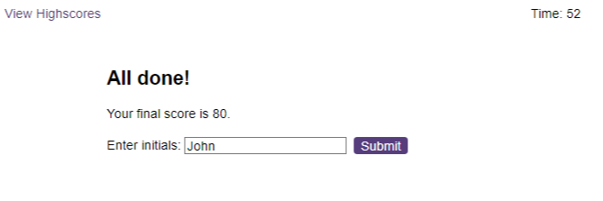

# Coding-Quiz

## Description

This is a coding quiz challenge to test JavaScript skills. There are some questions in this challenge and it's given 75 seconds to complete all questions. Time is substracted from the countdown timer if a wrong answer is given. This quiz challenge ends when all questions are answered or the time is up. The challenger will be given the final score for this challenge and the challenger can save the score with initials. The scoreboard lists out all the scores that each challenger is saved so that the challenger can keep track on the progress. The application also provides option for the challenger to clear all the scores and starts the quiz again.

Challengers can restart the quiz as many times as they want but the options for each question will be shown in different order for each game. This requires challenger to look into the options to select the correct one each time rather than letting them to memorise where the position of the correct option is.
 

## Table of Contents

- **[How to Play](#how-to-play)**
  - [Landing Page](#landing-page)
  - [Answer Question](#answer-question)
  - [Result and New Question](#result-and-new-question)
  - [Quiz Ends](#quiz-ends)
  - [Scoreboard](#scoreboard)
- [Deployment](#deployment)
- [Authors](#authors)
- [License](#license)

 

## How to Play

### Landing Page

This is the landing page where the challenger can start the quiz by clicking the 'Start Quiz' button or can view the scoreboard by clicking the 'View Highscores' on the top left corner.

 

### Answer Question

A question is given to the chanllenger to answer. The timer also starts to count down.

 

### Result and New Question

A new question shows up after the previous question is answered. The result for the previous question is shown below the new question.

### Quiz Ends

The quiz ends after all questions are answered or timer ticks down to 0. Final score is given and the challenger can save the score with initials. After the score has been saved, the application will show the scoreboard to the challenger.

### Scoreboard

The challenger can see ranks in scoreboard. Click the 'Go Back' button to go back to the landing page. The challenger can clear all scores by using the 'Clear High Scores' button.

## Deployment

Start the quiz <a href="https://mingzhao91.github.io/Coding-Quiz/" target="_blank">here</a>.
 

## Authors

- **Mingzhao Zhou** - <a href="https://github.com/Mingzhao91" target="_blank">Mingzhao91</a>
   

## License

This project is licensed under the MIT License.
